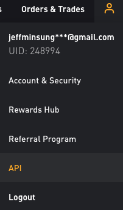
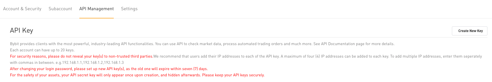
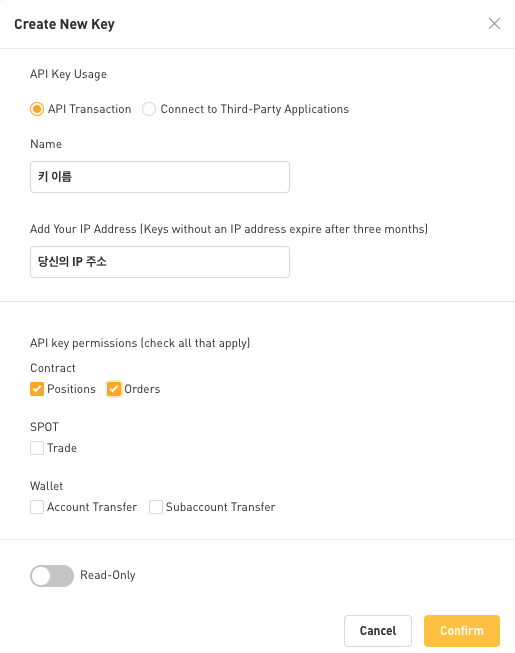
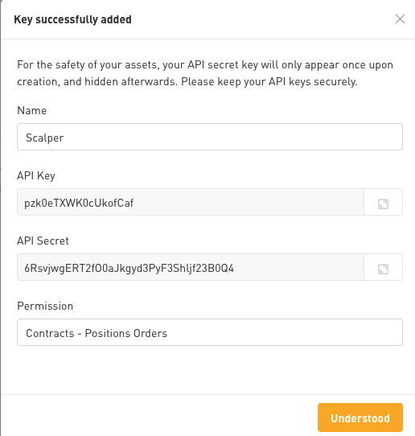
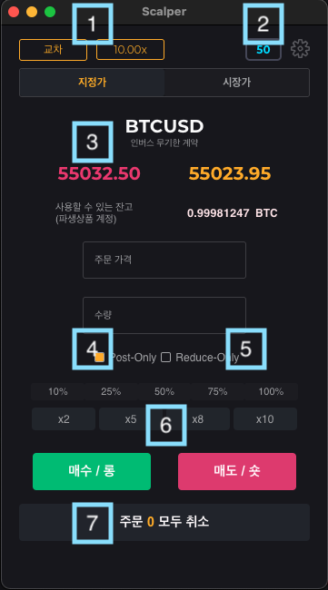

<h1 align="center">

  <a href="https://www.bybit.com" target="_blank">
    
    

가격 변동이 큰 암호화폐 호가창

  </a>

</h1>

## 스캘퍼란 무엇인가요?

스캘퍼(Scalper)는 [바이비트](https://www.bybit.com/en-US/) 암호화폐 파생상품 거래소를 이용하는 모든 트레이더에게 거래소의 기존 사용자 인터페이스(UI)보다 편리하게 매매할 수 있도록 더 좋은 사용자 경험(UX)을 바탕으로 설계된 어시스턴트(Assistant) 애플리케이션입니다.

## 주요 기능

- 비트코인(BTC) 인버스 무기한 계약 지원(기타 페어 지원 예정)
- 가격 변동이 클 때도 내가 원하는 호가에 **빠르고 정확한** 지정가 거래 📌
- 다량의 주문을 설정한 호가 간격으로 한 번에 넣을 수 있는 **퀵 주문** ⚡️
- 1-Click으로 모든 주문 취소 ✅
- 단축키로 주문을 빠르게 넣고 취소 ⌨️(기능 추가 예정)
- 다국어 지원 🌐

---

## 시작하기에 앞서

스캘퍼를 사용하려면 사용자의 API 키가 필요합니다. 아래 이미지가 가리키는 메뉴를 클릭하세요.

아래 이미지 우측에 보이는 `Create New Key` 버튼을 클릭하세요.

아래 이미지처럼 항목을 선택하시고 확인 버튼을 누르세요. [IP주소 확인하기](https://search.naver.com/search.naver?where=nexearch&sm=top_hty&fbm=0&ie=utf8&query=ip%EC%A3%BC%EC%86%8C+%ED%99%95%EC%9D%B8)

> IP 주소를 입력하지 않으면, 3개월마다 키를 새로 발급 받아야 하므로 반드시 입력해주세요. 키 이름은 중요하지 않지만 앱에 표시됩니다.

키를 성공적으로 발급 받았다면 아래와 같은 화면이 보입니다.

🚧 API Secret은 단 한 번만 노출되므로 따로 잘 보관하셔야 합니다. 또한, **절대 타인에게 노출해서는 안 됩니다!**

위 과정을 모두 성공적으로 마쳤다면, 애플리케이션을 실행시킨 후 저장해놓은 API 키와 시크릿을 복사하신 후 각 입력란에 붙여넣고 시작하기 버튼을 클릭합니다.

## 사용 방법

앞선 단계에서 입력하신 API 키와 시크릿이 유효하다면, 위와 같은 메인 콘솔 화면을 마주하셨을 겁니다. 이제 각 주요 기능 버튼을 한 번 알아볼까요?

### 기능 버튼 설명

1️⃣

마진 및 레버리지 조절을 할 수 있는 페이지로 이동합니다.

2️⃣

인버스 상품의 틱(Tick) 간격을 의미하며, 기본 값은 50 USD.
e.g. 50틱인 상태에서 주문 가격 창에 50,000을 입력한 후 `x2 퀵 주문 버튼`을 활성화한 상태에서 매수/롱 버튼을 누르면 `49,950과 49,900` 호가에 주문이 지정가로 들어갑니다.

3️⃣

현재 가격(실시간). 해당 영역을 클릭하면 가격 창에 자동으로 값이 입력됩니다.

4️⃣

Post-Only(포스트 온리)는 시장가로 주문이 들어가는 것을 사전에 방지해줍니다. 다시 말해, 지정가 주문을 보장하는 기능입니다. 지정가로 거래할 시 거래자는 바이비트 측으로부터 수수료를 받기 때문에 이 점을 활용하여 수익을 극대화하고자 현재 스캘퍼에서는 바이비트와는 다르게 항상 강제화하고 있습니다.

5️⃣

Reduce-Only(리듀스 온리)는 포지션을 줄일 때만 사용 가능합니다. 예를 들어 사용자의 계약이 3,000 USD 매수(Long) 포지션일 경우, 3,000개만 매도할 수 있게끔 강제화합니다. 다시 말해, 매도(Short) 포지션이 새로 생성되는 불상사를 방지해줍니다.

6️⃣

4개의 퀵 주문 버튼을 개별로 클릭하여 활성화할 수 있습니다. 클릭한 버튼은 별도의 활성화 표시 띄고, 주문 가격(기준)이 있는 상태에서 버튼에 표시된 개수만큼 틱(Tick) 간격으로 한꺼번에 주문을 빠르고 정확하게 넣습니다.

> ❗️ 짧은 시간 내에 많은 주문을 요청하게 될 경우, 모든 퀵 주문 버튼은 60초의 쿨 타임을 갖습니다. 이 시간 동안은 퀵 주문 기능을 사용할 수 없습니다.

7️⃣

활성화된 모든 주문을 취소합니다. 바이비트에서 두 번 클릭하여 일괄 취소하는 번거로움을 없앴습니다.

> ❗️ 많은 양의 활성화된 주문을 취소하게 되면 모든 퀵 주문 버튼은 10초의 쿨 타임을 갖습니다. 이 시간 동안은 퀵 주문 기능을 사용할 수 없습니다.

